The purpose of this document is to perform EDA on the `clean_assessments.csv` data to identify patterns in the data that will inform a model of sale price.


```r
library(tidyverse)
library(lubridate)

library(sf)
library(leaflet)

library(skimr)
library(hrbrthemes)
library(janitor)
library(scales)

library(here)

#here::i_am("scripts/eda")

options(scipen = 999, digits = 4)

theme_set(theme_ipsum())

assessment_data_path <- here("data/cleaned/big", "clean_assessment_data_geocoded.csv")

unified_geo_ids_path <- here("data/cleaned/big/unified_geo_ids/unified_geo_ids.shp")

assessments_valid <- read_csv(assessment_data_path) %>% 
  mutate(sale_month = factor(sale_month, levels = month.abb))

geo_ids <- st_read(unified_geo_ids_path, quiet = T)
```

### Get an idea of the data


```r
glimpse(assessments_valid)
```

```
## Rows: 157,925
## Columns: 31
## $ par_id               <chr> "0467B00005000000", "0481L00052000000", "0936P003…
## $ usedesc              <chr> "SINGLE FAMILY", "TOWNHOUSE", "SINGLE FAMILY", "S…
## $ muni_desc            <chr> "Glassport", "South Fayette", "Bell Acres", "Eliz…
## $ sale_desc            <chr> "Valid Sale", "Other Valid", "Other Valid", "Vali…
## $ sale_price           <dbl> 61000, 96000, 688250, 66000, 48000, 192000, 90000…
## $ year_built           <dbl> 1945, 1979, 1958, 1915, 1927, 1950, 1974, 1985, 1…
## $ style_desc           <chr> "Old Style", "Townhouse", "Contemporary", "Bungal…
## $ bedrooms             <dbl> 3, 2, 4, 2, 2, 3, 4, 3, 2, 3, 4, 3, 3, 5, 4, 4, 2…
## $ full_baths           <dbl> 1, 1, 4, 2, 1, 1, 2, 2, 1, 1, 1, 2, 1, 3, 2, 2, 1…
## $ half_baths           <dbl> 0, 1, 2, 0, 0, 0, 1, 1, 0, 0, 1, 1, 1, 1, 1, 1, 0…
## $ finished_living_area <dbl> 1026, 1388, 4958, 1388, 840, 1167, 2132, 1760, 91…
## $ lot_area             <dbl> 4680, 1373, 68346, 29673, 6806, 11979, 11784, 600…
## $ grade_desc           <chr> "Average", "Average", "Very Good", "Average", "Be…
## $ condition_desc       <chr> "Average", "Average", "Average", "Average", "Aver…
## $ extfinish_desc       <chr> "Brick", "Masonry Frame", "Brick", "Frame", "Fram…
## $ roof_desc            <chr> "Shingle", "Shingle", "Metal", "Shingle", "Shingl…
## $ basement_desc        <chr> "Full", "Full", "Full", "Full", "Full", "Full", "…
## $ cdu_desc             <chr> "Average", "Good", "Average", "Average", "Average…
## $ heating_cooling_desc <chr> "Central Heat With AC", "Central Heat With AC", "…
## $ fireplaces           <dbl> 0, 0, 2, 0, 0, 1, 1, 1, 0, 1, 1, 1, 1, 1, NA, 1, …
## $ basement_garage      <dbl> 0, 1, 2, 0, 0, 1, 2, 2, 0, 0, 0, 2, 1, 2, NA, 2, …
## $ sale_year            <dbl> 2006, 2011, 2010, 1998, 2006, 2011, 1987, 1985, 2…
## $ sale_month           <fct> Jun, Apr, Dec, Aug, Mar, Jun, Jul, Dec, May, Jan,…
## $ school_desc          <chr> "South Allegheny", "South Fayette Twp", "Quaker V…
## $ house_age_at_sale    <dbl> 61, 32, 52, 83, 79, 61, 13, 0, 29, 56, 70, 8, 37,…
## $ ac_flag              <lgl> TRUE, TRUE, TRUE, FALSE, TRUE, TRUE, TRUE, TRUE, …
## $ heat_type            <chr> "Central Heat", "Central Heat", "Central Heat", "…
## $ sale_price_adj       <dbl> 78314, 110456, 816887, 104789, 61624, 220912, 204…
## $ geo_id               <chr> "South Allegheny", "South Fayette Township", "Qua…
## $ lng                  <dbl> -79.89, -80.12, -80.18, -79.87, -79.90, -79.88, -…
## $ lat                  <dbl> 40.33, 40.33, 40.58, 40.27, 40.38, 40.49, 40.54, …
```


```r
skim(assessments_valid)
```


Table: Data summary

|                         |                  |
|:------------------------|:-----------------|
|Name                     |assessments_valid |
|Number of rows           |157925            |
|Number of columns        |31                |
|_______________________  |                  |
|Column type frequency:   |                  |
|character                |15                |
|factor                   |1                 |
|logical                  |1                 |
|numeric                  |14                |
|________________________ |                  |
|Group variables          |None              |


**Variable type: character**

|skim_variable        | n_missing| complete_rate| min| max| empty| n_unique| whitespace|
|:--------------------|---------:|-------------:|---:|---:|-----:|--------:|----------:|
|par_id               |         0|             1|  16|  16|     0|   157924|          0|
|usedesc              |         0|             1|   8|  22|     0|       13|          0|
|muni_desc            |         0|             1|   4|  23|     0|      174|          0|
|sale_desc            |         0|             1|  10|  11|     0|        2|          0|
|style_desc           |         0|             1|   3|  13|     0|       20|          0|
|grade_desc           |         0|             1|   4|  13|     0|        7|          0|
|condition_desc       |        22|             1|   4|   9|     0|        8|          0|
|extfinish_desc       |         1|             1|   3|  14|     0|        8|          0|
|roof_desc            |       207|             1|   4|   7|     0|        6|          0|
|basement_desc        |        30|             1|   4|  10|     0|        5|          0|
|cdu_desc             |        26|             1|   4|   9|     0|        8|          0|
|heating_cooling_desc |        26|             1|   4|  21|     0|       15|          0|
|school_desc          |         0|             1|   6|  20|     0|       78|          0|
|heat_type            |        26|             1|   4|  13|     0|        9|          0|
|geo_id               |         0|             1|   7|  23|     0|       54|          0|


**Variable type: factor**

|skim_variable | n_missing| complete_rate|ordered | n_unique|top_counts                                     |
|:-------------|---------:|-------------:|:-------|--------:|:----------------------------------------------|
|sale_month    |         0|             1|FALSE   |       12|Jun: 16781, Jul: 16754, Aug: 16503, May: 14878 |


**Variable type: logical**

|skim_variable | n_missing| complete_rate| mean|count                   |
|:-------------|---------:|-------------:|----:|:-----------------------|
|ac_flag       |        26|             1| 0.65|TRU: 101971, FAL: 55928 |


**Variable type: numeric**

|skim_variable        | n_missing| complete_rate|      mean|        sd|      p0|      p25|       p50|       p75|       p100|hist  |
|:--------------------|---------:|-------------:|---------:|---------:|-------:|--------:|---------:|---------:|----------:|:-----|
|sale_price           |         0|          1.00| 130055.93| 126771.46|  325.00| 55000.00|  92500.00| 160600.00| 3070000.00|▇▁▁▁▁ |
|year_built           |         0|          1.00|   1950.83|     29.69| 1800.00|  1930.00|   1953.00|   1970.00|    2020.00|▁▁▅▇▃ |
|bedrooms             |         8|          1.00|      3.06|      0.88|    0.00|     3.00|      3.00|      4.00|      14.00|▂▇▁▁▁ |
|full_baths           |        20|          1.00|      1.50|      0.67|    0.00|     1.00|      1.00|      2.00|      12.00|▇▁▁▁▁ |
|half_baths           |       997|          0.99|      0.54|      0.57|    0.00|     0.00|      0.00|      1.00|       9.00|▇▁▁▁▁ |
|finished_living_area |         0|          1.00|   1703.14|    761.18|    0.00|  1188.00|   1512.00|   2031.00|   12790.00|▇▁▁▁▁ |
|lot_area             |         0|          1.00|  13222.54|  37790.03|    0.00|  3980.00|   7521.00|  12981.00| 4859466.00|▇▁▁▁▁ |
|fireplaces           |      9040|          0.94|      0.43|      0.57|    0.00|     0.00|      0.00|      1.00|       7.00|▇▁▁▁▁ |
|basement_garage      |      4046|          0.97|      0.79|      0.84|    0.00|     0.00|      1.00|      1.00|       6.00|▇▂▁▁▁ |
|sale_year            |         0|          1.00|   2002.01|     11.96| 1976.00|  1993.00|   2003.00|   2013.00|    2021.00|▃▆▇▇▇ |
|house_age_at_sale    |         0|          1.00|     51.19|     30.52|    0.00|    28.00|     50.00|     71.00|     219.00|▇▇▂▁▁ |
|sale_price_adj       |         0|          1.00| 179798.20| 149366.07|  417.25| 91448.57| 142828.85| 219234.73| 3507768.06|▇▁▁▁▁ |
|lng                  |         0|          1.00|    -79.97|      0.12|  -80.35|   -80.05|    -79.98|    -79.88|     -79.70|▁▂▇▆▂ |
|lat                  |         0|          1.00|     40.45|      0.09|   40.20|    40.38|     40.44|     40.51|      40.67|▁▅▇▅▂ |

### Sales Price

Inflation-adjusted sales price (`sale_price_adj`) is normally distributed on the `log10()` scale, as expected.

```r
assessments_valid %>% 
  ggplot(aes(sale_price_adj)) +
  geom_density() +
  scale_x_log10(labels = dollar)
```

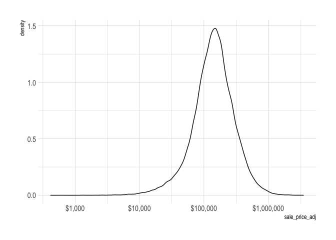<!-- -->

Adjusting for inflation (`sale_price_adj` is in 2020 dollars) removes a lot of the drift over time.

```r
assessments_valid %>%
  select(sale_year, sale_price, sale_price_adj) %>% 
  pivot_longer(cols = contains("sale_price")) %>% 
  mutate(name = case_when(name == "sale_price" ~ "Nominal dollars",
                          name == "sale_price_adj" ~ "Inflation-adjusted 2020 dollars")) %>% 
  ggplot(aes(sale_year, value, color = name)) +
  geom_smooth() +
  labs(x = "Sale Year",
       y = "Price",
       color = NULL) +
  scale_y_continuous(labels = dollar)
```

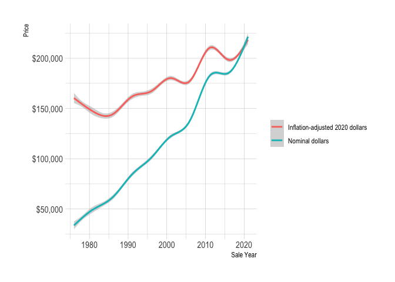<!-- -->

House sales have plateaued since the 2008 mortgage crisis, with more year-to-year variation.

```r
sale_year_count <- assessments_valid %>% 
  count(sale_year)

sale_year_count %>% 
  mutate(year_flag = case_when(sale_year == 2021 ~ "2021",
                               sale_year < 2021 ~ "Before 2021")) %>% 
  ggplot(aes(sale_year, n)) +
  geom_smooth(data = sale_year_count %>% 
                filter(sale_year != 2021),
              se = F) +
  geom_point(aes(color = year_flag)) +
  labs(x = "Sale Year",
       y = "Sales",
       color = NULL)
```

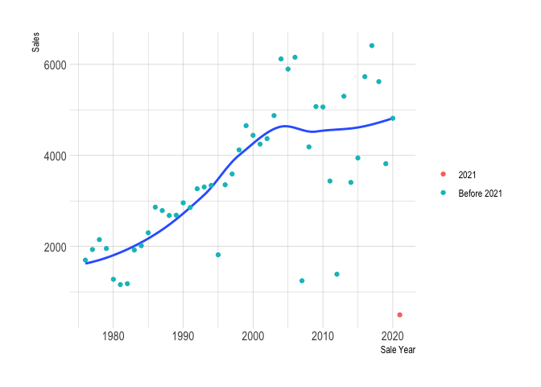<!-- -->

Median sale price and the number of sales both peak over the summer months.

```r
assessments_valid %>% 
  mutate(sale_month = fct_rev(sale_month)) %>% 
  add_count(sale_month) %>% 
  ggplot(aes(sale_month, sale_price_adj, group = sale_month, fill = n)) +
  geom_boxplot(outlier.alpha = 0,
               color = "grey") +
  labs(fill = "Sales") +
  scale_y_log10() +
  coord_cartesian(ylim = c(10^4, 10^6)) +
  scale_fill_viridis_c()
```

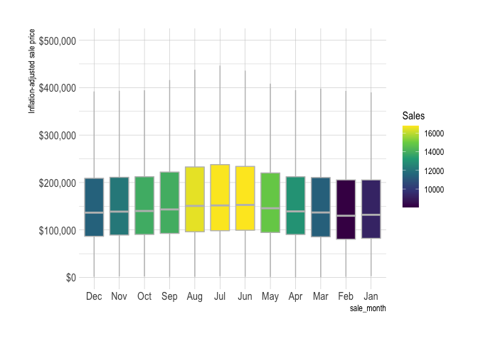<!-- -->

### Location

The location of the house (`geo_id`) has a big impact on `sale_price_adj`.


```r
assessments_valid %>%
  add_count(geo_id) %>% 
  mutate(geo_id = fct_reorder(geo_id, sale_price_adj, .fun = median)) %>% 
  ggplot(aes(sale_price_adj, geo_id, fill = n)) +
  geom_boxplot(outlier.alpha = 0,
               color = "grey") +
  scale_x_log10(label = dollar) +
  scale_fill_viridis_c() +
  labs(fill = "Sales")
```

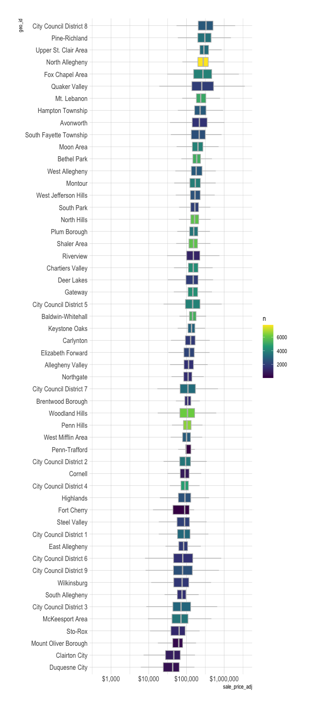<!-- -->

### House Characteristics

The age of the house at time of sale has a negative relationship with sale price, but is heteroskedastic. This indicates that some houses retain their value better over time (and/or houses that don't retain value aren't bought and sold).

```r
assessments_valid %>% 
  ggplot(aes(house_age_at_sale, sale_price_adj)) +
  geom_density_2d_filled(contour_var = "count") +
  scale_y_log10(labels = dollar) +
  guides(fill = guide_colorsteps()) +
  labs(y = "Inflation-adjusted price log10 scale",
       fill = "Sales")
```

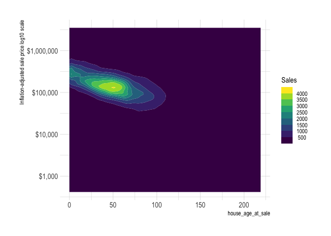<!-- -->

#### Lot Area

There is a positive relationship between `lot_area` and `sale_price_adj`.

```r
assessments_valid %>% 
  ggplot(aes(lot_area, sale_price_adj)) +
  geom_density_2d_filled(contour_var = "count") +
  scale_y_log10(labels = dollar) +
  scale_x_log10() +
  guides(fill = guide_colorsteps()) +
  labs(x = "Lot area sq. ft. log10 scale",
       y = "Inflation-adjusted price log10 scale",
       fill = "Sales")
```

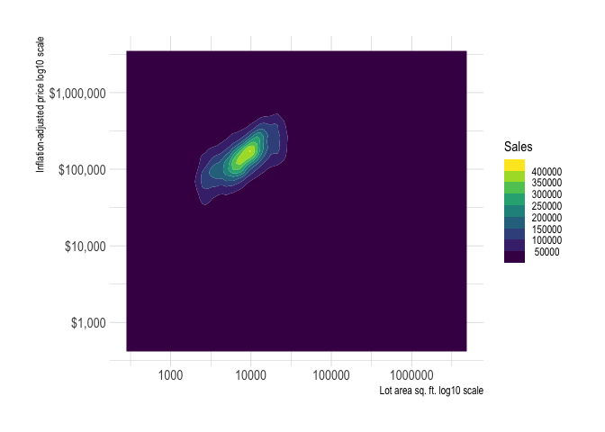<!-- -->

`lot_area` varies drastically across `geo_id`, so there is probably a useful feature to be engineered.

```r
assessments_valid %>% 
  add_count(geo_id) %>% 
  mutate(geo_id = fct_reorder(geo_id, lot_area, .fun = median)) %>% 
  ggplot(aes(lot_area, geo_id, fill = n)) +
geom_boxplot(outlier.alpha = 0,
               color = "grey") +
  scale_x_log10() +
  scale_fill_viridis_c() +
  labs(x = "Lot area sq. ft. log10 scale",
       fill = "Sales")
```

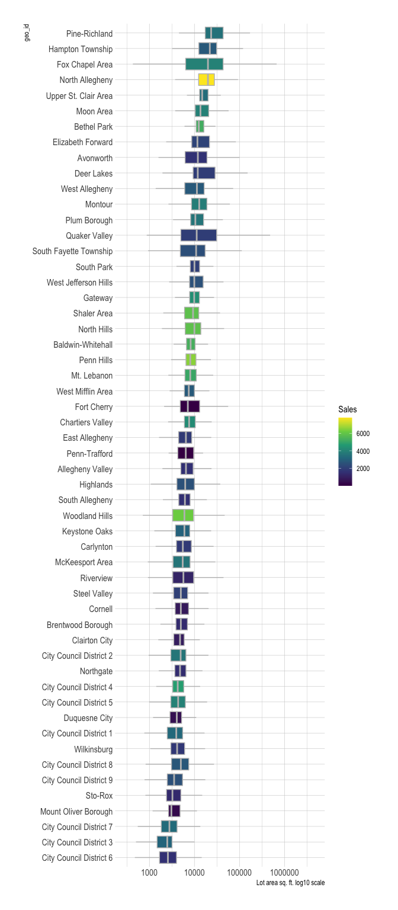<!-- -->

`lot_area` also varies across `style_desc`.

```r
assessments_valid %>% 
  add_count(style_desc) %>% 
  mutate(style_desc = fct_reorder(style_desc, lot_area, .fun = median)) %>% 
  ggplot(aes(lot_area, style_desc, fill = n)) +
geom_boxplot(outlier.alpha = 0,
               color = "grey") +
  scale_x_log10() +
  scale_fill_viridis_c() +
  labs(x = "Lot area sq. ft. log10 scale",
       fill = "Sales")
```

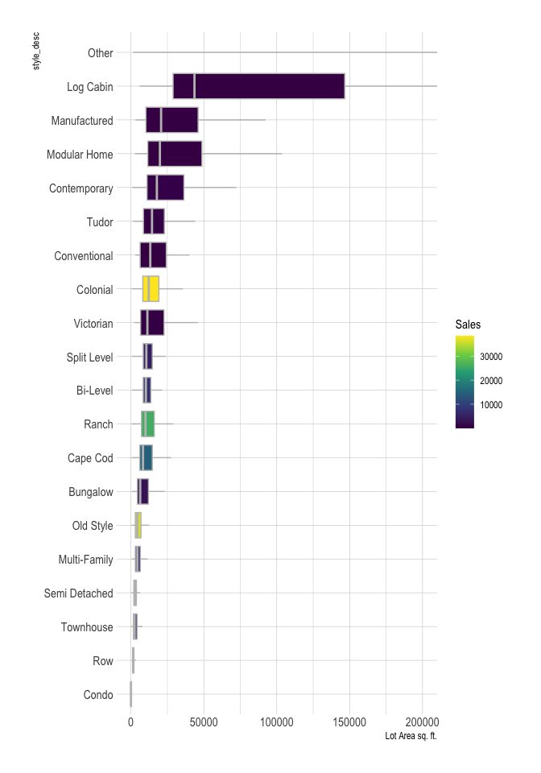<!-- -->

#### Finished Living Area

`finished_living_area` will be a useful variable.

```r
assessments_valid %>% 
  ggplot(aes(finished_living_area, sale_price_adj)) +
  geom_density_2d_filled(contour_var = "count") +
  scale_x_log10() +
  scale_y_log10(labels = dollar) +
  guides(fill = guide_colorsteps()) +
  labs(x = "Finished Living Area sq. ft. log10 scale",
       y = "Inflation-adjusted price log10 scale",
       fill = "Sales")
```

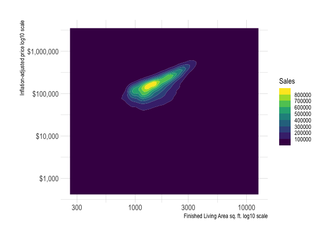<!-- -->

`finished_living_area` also varies across `style_desc`.

```r
assessments_valid %>% 
  add_count(style_desc) %>% 
  mutate(style_desc = fct_reorder(style_desc, finished_living_area, .fun = median)) %>% 
  ggplot(aes(finished_living_area, style_desc, fill = n)) +
geom_boxplot(outlier.alpha = 0,
               color = "grey") +
  scale_x_log10() +
  #coord_cartesian(xlim = c(0, 10^4)) +
  scale_fill_viridis_c() +
  labs(x = "Finished Living Area sq. ft. log10 scale",
       fill = "Sales")
```

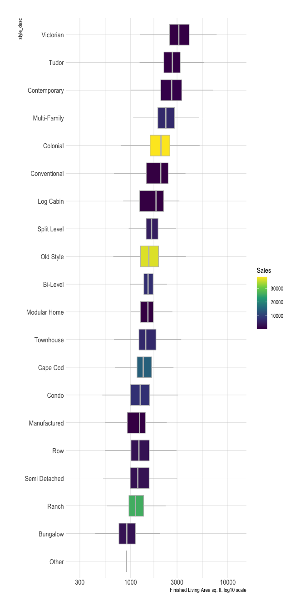<!-- -->

`finished_living_area` also varies across `geo_id`, but not as drastically.

```r
assessments_valid %>% 
  add_count(geo_id) %>% 
  mutate(geo_id = fct_reorder(geo_id, finished_living_area, .fun = median)) %>% 
  ggplot(aes(finished_living_area, geo_id, fill = n)) +
geom_boxplot(outlier.alpha = 0,
               color = "grey") +
  scale_x_log10() +
  #coord_cartesian(xlim = c(0, 10000)) +
  scale_fill_viridis_c() +
  labs(x = "Finished Living Area sq. ft. log10 scale",
       fill = "Sales")
```

<!-- -->

#### Grade

`grade_desc` has a clear relationship with `sale_price_adj`.

```r
assessments_valid %>% 
  mutate(grade_desc = fct_reorder(grade_desc, sale_price_adj, median)) %>% 
  add_count(grade_desc) %>% 
  ggplot(aes(sale_price_adj, grade_desc, fill = n)) +
  geom_boxplot(outlier.alpha = 0,
               color = "grey") +
  scale_x_log10(labels = dollar) +
  scale_fill_viridis_c() +
  labs(x = "Inflation-adjusted price log10 scale",
       fill = "Sales")
```

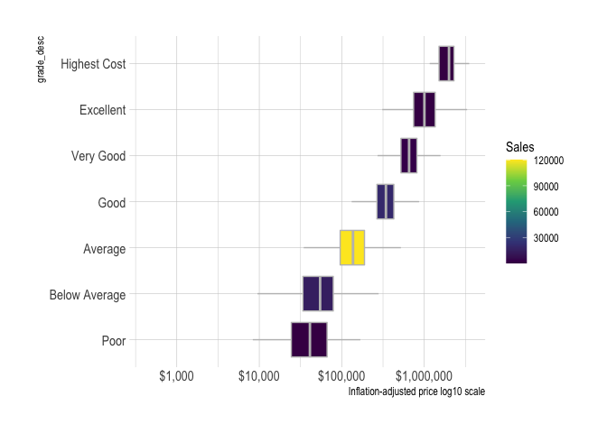<!-- -->

#### Condition

`condition_desc` also has a relationship, but some of the levels can probably be collapsed.

```r
assessments_valid %>% 
  mutate(condition_desc = fct_reorder(condition_desc, sale_price_adj, median)) %>% 
  add_count(condition_desc) %>% 
  ggplot(aes(sale_price_adj, condition_desc, fill = n)) +
  geom_boxplot(outlier.alpha = 0,
               color = "grey") +
  scale_x_log10(labels = dollar) +
  scale_fill_viridis_c() +
  labs(x = "Inflation-adjusted price log10 scale",
       fill = "Sales")
```

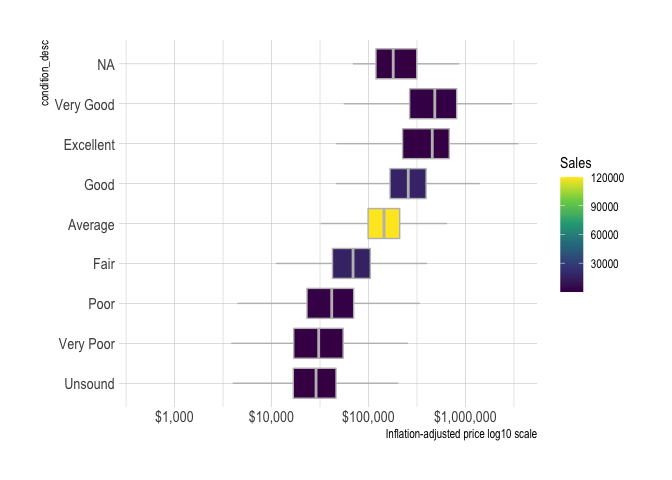<!-- -->

There are 4 main types of houses, with a lot of low-n types that can be collapsed.

```r
assessments_valid %>% 
  count(style_desc) %>% 
  mutate(style_desc = fct_reorder(style_desc, n, .fun = max)) %>% 
  ggplot(aes(n, style_desc)) +
  geom_col()
```

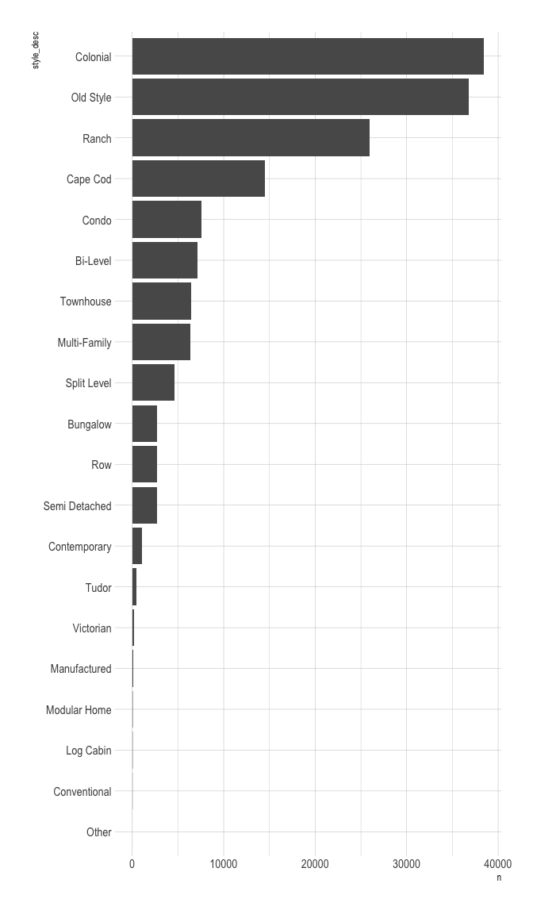<!-- -->

There is some time-series pattern in when different types of houses were created.

```r
assessments_valid %>% 
  add_count(style_desc) %>% 
  filter(n > 5000) %>% 
  mutate(style_desc = fct_reorder(style_desc, n, .fun = "max", .desc = T)) %>% 
  ggplot(aes(year_built, fill = style_desc)) +
  geom_histogram(binwdidth = 30) +
  guides(fill = "none") +
  facet_wrap(~style_desc, scales = "free_y", ncol = 2)
```

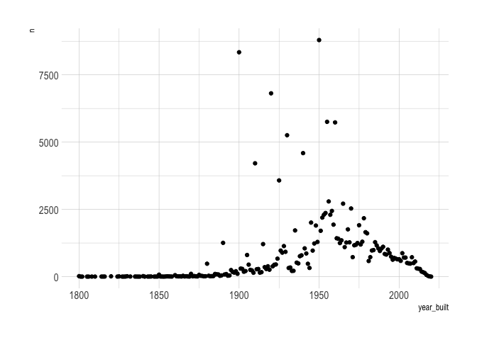<!-- -->

#### Bathrooms

Most homes have between 1 and 2 full and half bathrooms.

```r
assessments_valid %>% 
  count(full_baths, half_baths) %>% 
  complete(full_baths = 0:12, half_baths = 0:9, fill = list(n = 0)) %>% 
  ggplot(aes(full_baths, half_baths, fill = n)) +
  geom_tile() +
  scale_fill_viridis_c() +
  scale_x_continuous(breaks = c(0:12),
                     expand = c(0,0)) +
  scale_y_continuous(breaks = c(0:12),
                     expand = c(0,0)) +
  coord_equal() +
  labs(fill = "Sales") +
  theme(panel.grid.major = element_blank(),
        panel.grid.minor = element_blank())
```

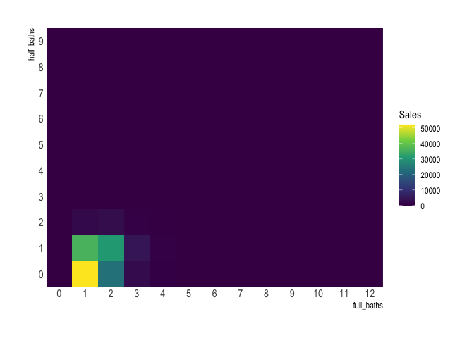<!-- -->

`fullbaths` and `sale_price_adj` are positively related.

```r
assessments_valid %>% 
  add_count(full_baths) %>% 
  ggplot(aes(sale_price_adj, full_baths, fill = n, group = full_baths)) +
  geom_boxplot(outlier.alpha = 0,
               color = "grey") +
  scale_x_log10(label = dollar) +
  scale_y_continuous(breaks = c(0:12)) +
  scale_fill_viridis_c() +
  labs(x = "Inflation-adjusted price log10 scale",
       fill = "Sales")
```

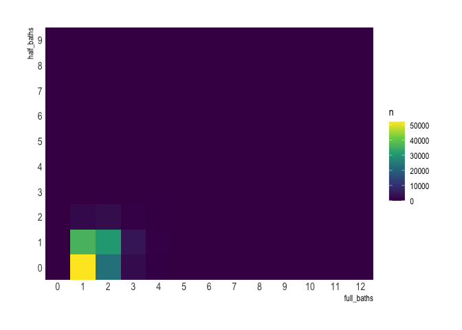<!-- -->

There appear to be diminishing returns on the number of half bathrooms.

```r
assessments_valid %>% 
  add_count(half_baths) %>% 
  ggplot(aes(sale_price_adj, half_baths, fill = n, group = half_baths)) +
  geom_boxplot(outlier.alpha = 0,
               color = "grey") +
  scale_x_log10(label = dollar) +
  scale_y_continuous(breaks = c(0:9)) +
  scale_fill_viridis_c() +
  labs(x = "Inflation-adjusted price log10 scale",
       fill = "Sales")
```

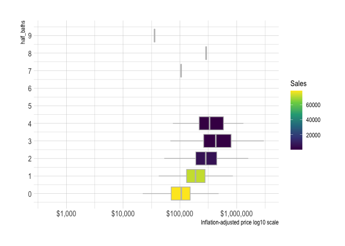<!-- -->

#### Heating and cooling

Need to split these out to heat_type and ac_flag.

```r
assessments_valid %>% 
  mutate(heating_cooling_desc = fct_reorder(heating_cooling_desc, sale_price_adj, .fun = median)) %>% 
  add_count(heating_cooling_desc) %>% 
  ggplot(aes(sale_price_adj, heating_cooling_desc, fill = n)) +
  geom_boxplot(outlier.alpha = 0,
               color = "grey") +
  scale_x_log10(label = dollar) +
  scale_fill_viridis_c() +
  labs(x = "Inflation-adjusted price log10 scale",
       fill = "Sales")
```

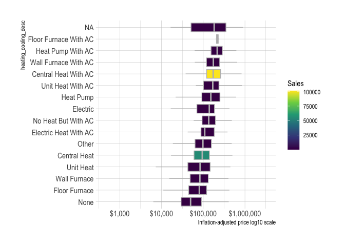<!-- -->

The type of heating is positively related to sale price.

```r
assessments_valid %>% 
  mutate(heat_type = fct_explicit_na(heat_type),
         heat_type = fct_reorder(heat_type, sale_price_adj, .fun = median)) %>% 
  add_count(heat_type) %>% 
  ggplot(aes(sale_price_adj, heat_type, fill = n)) +
  geom_boxplot(outlier.alpha = 0,
               color = "grey") +
  scale_x_log10(label = dollar) +
  scale_fill_viridis_c() +
  labs(x = "Inflation-adjusted price log10 scale",
       fill = "Sales")
```

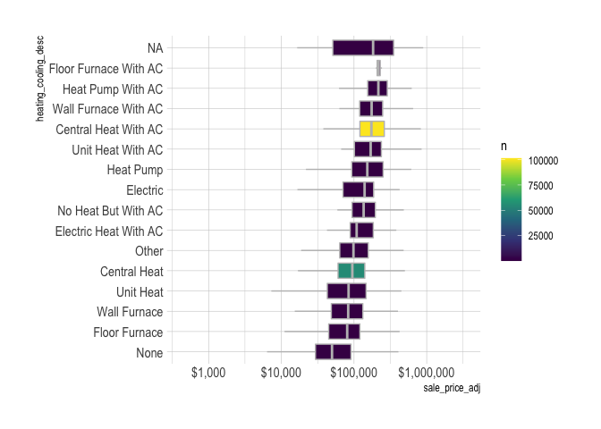<!-- -->

Whether the house has AC is also positively related to sale price.

```r
assessments_valid %>% 
  mutate(ac_flag = as.character(ac_flag),
         ac_flag = fct_explicit_na(ac_flag)) %>% 
  mutate(ac_flag = fct_reorder(ac_flag, sale_price_adj, .fun = median)) %>% 
  add_count(ac_flag) %>% 
  ggplot(aes(sale_price_adj, ac_flag, fill = n)) +
  geom_boxplot(outlier.alpha = 0,
               color = "grey") +
  scale_x_log10(label = dollar) +
  scale_fill_viridis_c() +
  labs(fill = "Sales")
```

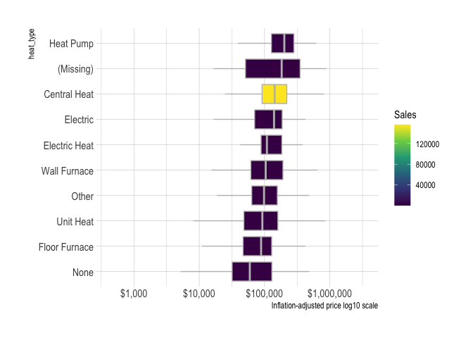<!-- -->

#### Exterior

Impute missing based on mode for `geo_id` and `style_desc.`

```r
assessments_valid %>% 
  mutate(extfinish_desc = fct_explicit_na(extfinish_desc),
         extfinish_desc = fct_reorder(extfinish_desc, sale_price_adj, .fun = median)) %>% 
  add_count(extfinish_desc) %>% 
  ggplot(aes(sale_price_adj, extfinish_desc, fill = n)) +
  geom_boxplot(outlier.alpha = 0,
               color = "grey") +
  scale_x_log10(label = dollar) +
  scale_fill_viridis_c() +
  labs(x = "Inflation-adjusted price log10 scale",
       fill = "Sales")
```

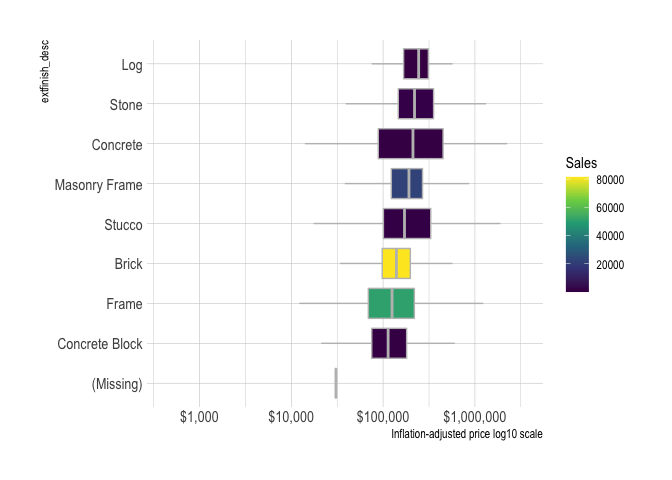<!-- -->

#### Roof

Impute missing based on mode for `geo_id` and `style_desc.`

```r
assessments_valid %>% 
  mutate(roof_desc = fct_explicit_na(roof_desc),
         roof_desc = fct_reorder(roof_desc, sale_price_adj, .fun = median)) %>% 
  add_count(roof_desc) %>% 
  ggplot(aes(sale_price_adj, roof_desc, fill = n)) +
  geom_boxplot(outlier.alpha = 0,
               color = "grey") +
  scale_x_log10(label = dollar) +
  scale_fill_viridis_c() +
  labs(x = "Inflation-adjusted price log10 scale",
       fill = "Sales")
```

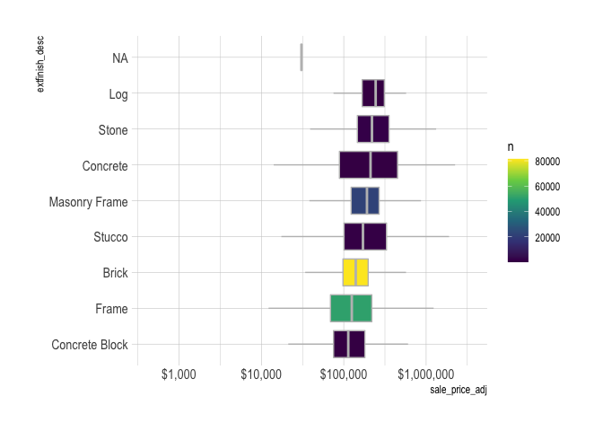<!-- -->

#### Basement

Impute missing based on mode for `geo_id` and `style_desc.`

```r
assessments_valid %>% 
  mutate(basement_desc = fct_explicit_na(basement_desc),
         basement_desc = fct_reorder(basement_desc, sale_price_adj, .fun = median)) %>% 
  add_count(basement_desc) %>% 
  ggplot(aes(sale_price_adj, basement_desc, fill = n)) +
  geom_boxplot(outlier.alpha = 0,
               color = "grey") +
  scale_x_log10(label = dollar) +
  scale_fill_viridis_c() +
  labs(fill = "Sales")
```

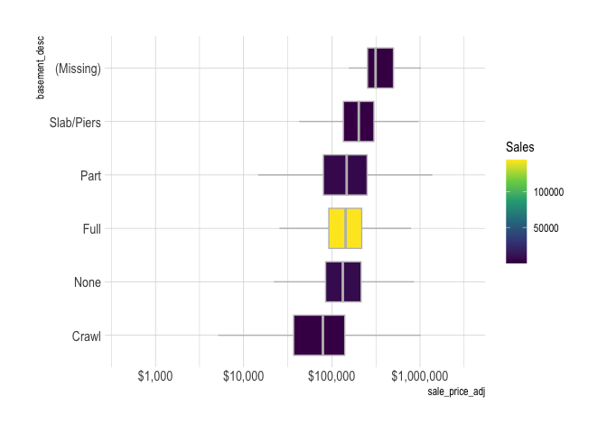<!-- -->

#### Basement garage

Impute missing based on mode for `geo_id` and `style_desc.`
Need to look up what this column is. Number of cars that can fit in the basement garage?

```r
max_basement_garage <- assessments_valid %>% 
  summarize(max(basement_garage, na.rm = T)) %>% 
  pull()

assessments_valid %>% 
  select(sale_price_adj, basement_garage) %>% 
  mutate(basement_garage = as.character(basement_garage),
         basement_garage = fct_explicit_na(basement_garage),
         basement_garage = fct_relevel(basement_garage, c(as.character(0:max_basement_garage), "(Missing)"))) %>% 
  add_count(basement_garage) %>% 
  ggplot(aes(sale_price_adj, basement_garage, group = basement_garage, fill = n)) +
  geom_boxplot(outlier.alpha = 0,
               color = "grey") +
  scale_x_log10(label = dollar) +
  scale_fill_viridis_c() +
  labs(fill = "Sales")
```

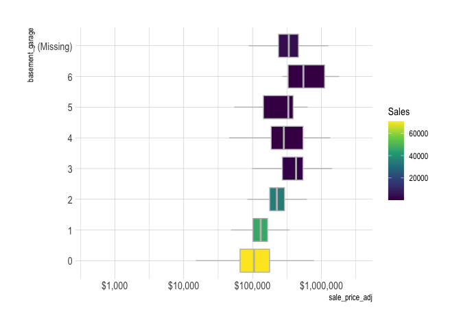<!-- -->

#### Fireplaces

Positive relationship between number of fireplaces and sale price, but most houses have 1 or 2. Consider changing to lgl `fireplace_flag` column where it checks `fireplaces` >= 1.

```r
#need to deal with missing fireplace rows
max_fireplaces <- assessments_valid %>% 
  summarize(max(fireplaces, na.rm = T)) %>% 
  pull()


assessments_valid %>% 
  select(sale_price_adj, fireplaces) %>% 
  mutate(fireplaces = as.character(fireplaces),
         fireplaces = fct_explicit_na(fireplaces),
         fireplaces = fct_relevel(fireplaces, c(as.character(0:max_fireplaces), "(Missing)"))) %>% 
  add_count(fireplaces) %>% 
  ggplot(aes(sale_price_adj, fireplaces, group = fireplaces, fill = n)) +
  geom_boxplot(outlier.alpha = 0,
               color = "grey") +
  scale_x_log10(label = dollar) +
  scale_fill_viridis_c() +
  labs(x = "Inflation-adjusted price log10 scale",
       fill = "Sales")
```

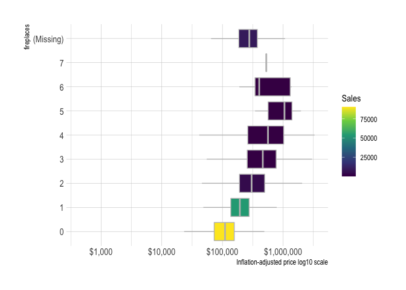<!-- -->

### Identify UI cutoffs


```r
assessments_valid %>% 
  ggplot(aes(lot_area)) +
  geom_density() +
  geom_vline(xintercept = 40000) +
  scale_x_log10()
```

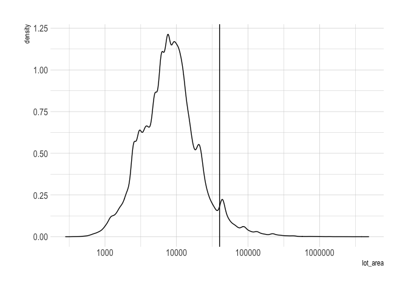<!-- -->


```r
assessments_valid %>% 
  ggplot(aes(finished_living_area)) +
  geom_density() +
  scale_x_log10() +
  geom_vline(xintercept = 10000)
```

<!-- -->
