Assessment EDA
================
Conor Tompkins
2022-09-18

The purpose of this document is to perform EDA on the
`clean_assessments.csv` data to identify patterns in the data that will
inform a model of sale price.

``` r
library(tidyverse)
library(lubridate)

library(sf)
library(leaflet)

library(skimr)
library(hrbrthemes)
library(janitor)
library(scales)

library(here)

#here::i_am("scripts/eda")

options(scipen = 999, digits = 4)

theme_set(theme_ipsum())

assessment_data_path <- here("data/cleaned/big", "clean_assessment_data_geocoded.csv")

unified_geo_ids_path <- here("data/cleaned/big/unified_geo_ids/unified_geo_ids.shp")

assessments_valid <- read_csv(assessment_data_path) %>% 
  mutate(sale_month = factor(sale_month, levels = month.abb))

geo_ids <- st_read(unified_geo_ids_path, quiet = T)
```

### Get an idea of the data

``` r
glimpse(assessments_valid)
```

    ## Rows: 120,872
    ## Columns: 31
    ## $ par_id               <chr> "0668L00360000000", "0815R00114000000", "0133G001…
    ## $ usedesc              <chr> "SINGLE FAMILY", "SINGLE FAMILY", "SINGLE FAMILY"…
    ## $ muni_desc            <chr> "Upper St. Clair", "Leet", "Munhall", "Elizabeth …
    ## $ sale_desc            <chr> "Valid Sale", "Valid Sale", "Valid Sale", "Valid …
    ## $ sale_price           <dbl> 158500, 64900, 48000, 71000, 90000, 89500, 92000,…
    ## $ year_built           <dbl> 1950, 1970, 1927, 1960, 1974, 1950, 1950, 2019, 1…
    ## $ style_desc           <chr> "Ranch", "Ranch", "Old Style", "Ranch", "Colonial…
    ## $ bedrooms             <dbl> 3, 3, 2, 2, 4, 3, 3, 2, 2, 3, 2, 4, 3, 4, 1, 2, 3…
    ## $ full_baths           <dbl> 1, 2, 1, 1, 2, 1, 1, 2, 2, 2, 1, 2, 2, 2, 1, 1, 2…
    ## $ half_baths           <dbl> 0, 1, 0, 0, 1, 0, 1, 2, 0, 1, 0, 1, 0, 1, 0, 0, 0…
    ## $ finished_living_area <dbl> 1440, 1377, 840, 914, 2132, 1266, 1726, 2523, 875…
    ## $ lot_area             <dbl> 61812, 20625, 6806, 36695, 11784, 7319, 15000, 20…
    ## $ grade_desc           <chr> "Average", "Average", "Below Average", "Average",…
    ## $ condition_desc       <chr> "Average", "Average", "Average", "Average", "Aver…
    ## $ extfinish_desc       <chr> "Stone", "Frame", "Frame", "Brick", "Masonry Fram…
    ## $ roof_desc            <chr> "Shingle", "Shingle", "Shingle", "Shingle", "Shin…
    ## $ basement_desc        <chr> "Full", "Full", "Full", "Full", "Full", "Full", "…
    ## $ cdu_desc             <chr> "Average", "Average", "Average", "Average", "Aver…
    ## $ heating_cooling_desc <chr> "Central Heat", "Central Heat With AC", "Central …
    ## $ fireplaces           <dbl> 1, 1, 0, 1, 1, 1, 1, NA, 0, NA, 0, 0, 1, 1, 0, NA…
    ## $ basement_garage      <dbl> 0, 2, 0, 0, 2, 1, 1, NA, 1, 0, 2, 1, 1, 2, 0, NA,…
    ## $ sale_year            <dbl> 2006, 1978, 2006, 2006, 1987, 2006, 1995, 2021, 2…
    ## $ sale_month           <fct> Jan, Feb, Mar, Mar, Jul, Aug, May, Feb, Feb, Oct,…
    ## $ school_desc          <chr> "Upper St Clair", "Quaker Valley", "Steel Valley"…
    ## $ house_age_at_sale    <dbl> 56, 8, 79, 46, 13, 56, 45, 2, 60, 12, 45, 79, 36,…
    ## $ ac_flag              <lgl> FALSE, TRUE, TRUE, FALSE, TRUE, FALSE, TRUE, TRUE…
    ## $ heat_type            <chr> "Central Heat", "Central Heat", "Central Heat", "…
    ## $ sale_price_adj       <dbl> 227437, 287708, 68877, 101880, 229104, 128427, 17…
    ## $ geo_id               <chr> "Upper St. Clair Area", "Quaker Valley", "Steel V…
    ## $ lng                  <dbl> -80.07, -80.21, -79.90, -79.83, -80.00, -79.83, -…
    ## $ lat                  <dbl> 40.31, 40.57, 40.38, 40.27, 40.54, 40.48, 40.52, …

``` r
skim(assessments_valid)
```

|                                                  |                   |
|:-------------------------------------------------|:------------------|
| Name                                             | assessments_valid |
| Number of rows                                   | 120872            |
| Number of columns                                | 31                |
| \_\_\_\_\_\_\_\_\_\_\_\_\_\_\_\_\_\_\_\_\_\_\_   |                   |
| Column type frequency:                           |                   |
| character                                        | 15                |
| factor                                           | 1                 |
| logical                                          | 1                 |
| numeric                                          | 14                |
| \_\_\_\_\_\_\_\_\_\_\_\_\_\_\_\_\_\_\_\_\_\_\_\_ |                   |
| Group variables                                  | None              |

Data summary

**Variable type: character**

| skim_variable        | n_missing | complete_rate | min | max | empty | n_unique | whitespace |
|:---------------------|----------:|--------------:|----:|----:|------:|---------:|-----------:|
| par_id               |         0 |             1 |  16 |  16 |     0 |   120872 |          0 |
| usedesc              |         0 |             1 |   8 |  22 |     0 |       13 |          0 |
| muni_desc            |         0 |             1 |   4 |  23 |     0 |      174 |          0 |
| sale_desc            |         0 |             1 |  10 |  11 |     0 |        2 |          0 |
| style_desc           |         0 |             1 |   3 |  13 |     0 |       20 |          0 |
| grade_desc           |         0 |             1 |   4 |  13 |     0 |        7 |          0 |
| condition_desc       |        12 |             1 |   4 |   9 |     0 |        8 |          0 |
| extfinish_desc       |         1 |             1 |   3 |  14 |     0 |        8 |          0 |
| roof_desc            |       164 |             1 |   4 |   7 |     0 |        6 |          0 |
| basement_desc        |        17 |             1 |   4 |  10 |     0 |        5 |          0 |
| cdu_desc             |        10 |             1 |   4 |   9 |     0 |        8 |          0 |
| heating_cooling_desc |        14 |             1 |   4 |  21 |     0 |       15 |          0 |
| school_desc          |         0 |             1 |   6 |  20 |     0 |       78 |          0 |
| heat_type            |        14 |             1 |   4 |  13 |     0 |        9 |          0 |
| geo_id               |         0 |             1 |   7 |  23 |     0 |       54 |          0 |

**Variable type: factor**

| skim_variable | n_missing | complete_rate | ordered | n_unique | top_counts                                     |
|:--------------|----------:|--------------:|:--------|---------:|:-----------------------------------------------|
| sale_month    |         0 |             1 | FALSE   |       12 | Jun: 12783, Jul: 12356, Aug: 12134, May: 11874 |

**Variable type: logical**

| skim_variable | n_missing | complete_rate | mean | count                  |
|:--------------|----------:|--------------:|-----:|:-----------------------|
| ac_flag       |        14 |             1 | 0.65 | TRU: 78978, FAL: 41880 |

**Variable type: numeric**

| skim_variable        | n_missing | complete_rate |      mean |        sd |      p0 |       p25 |       p50 |       p75 |       p100 | hist  |
|:---------------------|----------:|--------------:|----------:|----------:|--------:|----------:|----------:|----------:|-----------:|:------|
| sale_price           |         0 |          1.00 | 143097.56 | 144616.37 |  325.00 |  54950.00 |  99900.00 | 181000.00 | 3125000.00 | ▇▁▁▁▁ |
| year_built           |         0 |          1.00 |   1951.05 |     29.54 | 1755.00 |   1930.00 |   1954.00 |   1970.00 |    2021.00 | ▁▁▂▇▃ |
| bedrooms             |         2 |          1.00 |      3.06 |      0.87 |    0.00 |      3.00 |      3.00 |      4.00 |      14.00 | ▂▇▁▁▁ |
| full_baths           |        14 |          1.00 |      1.50 |      0.66 |    0.00 |      1.00 |      1.00 |      2.00 |      12.00 | ▇▁▁▁▁ |
| half_baths           |       785 |          0.99 |      0.54 |      0.58 |    0.00 |      0.00 |      1.00 |      1.00 |       8.00 | ▇▁▁▁▁ |
| finished_living_area |         0 |          1.00 |   1697.56 |    753.59 |  342.00 |   1190.00 |   1512.00 |   2016.00 |   12790.00 | ▇▁▁▁▁ |
| lot_area             |         0 |          1.00 |  13099.58 |  37728.66 |    0.00 |   4000.00 |   7593.00 |  12921.00 | 4859466.00 | ▇▁▁▁▁ |
| fireplaces           |      7035 |          0.94 |      0.43 |      0.57 |    0.00 |      0.00 |      0.00 |      1.00 |       9.00 | ▇▁▁▁▁ |
| basement_garage      |      3104 |          0.97 |      0.80 |      0.84 |    0.00 |      0.00 |      1.00 |      1.00 |       6.00 | ▇▂▁▁▁ |
| sale_year            |         0 |          1.00 |   2002.93 |     13.94 | 1976.00 |   1991.00 |   2005.00 |   2016.00 |    2022.00 | ▃▅▂▅▇ |
| house_age_at_sale    |         0 |          1.00 |     51.88 |     30.70 |    0.00 |     28.00 |     50.00 |     72.00 |     265.00 | ▇▆▁▁▁ |
| sale_price_adj       |         0 |          1.00 | 210002.63 | 171827.20 |  466.35 | 107644.67 | 168838.32 | 257119.69 | 3877278.56 | ▇▁▁▁▁ |
| lng                  |         0 |          1.00 |    -79.97 |      0.12 |  -80.34 |    -80.05 |    -79.98 |    -79.89 |     -79.70 | ▁▂▇▅▂ |
| lat                  |         0 |          1.00 |     40.45 |      0.09 |   40.20 |     40.38 |     40.44 |     40.51 |      40.67 | ▁▅▇▅▂ |

### Sales Price

Inflation-adjusted sales price (`sale_price_adj`) is normally
distributed on the `log10()` scale, as expected.

``` r
assessments_valid %>% 
  ggplot(aes(sale_price_adj)) +
  geom_density() +
  scale_x_log10(labels = dollar) +
  labs(x = "Inflation-adjusted sale price log10 scale")
```

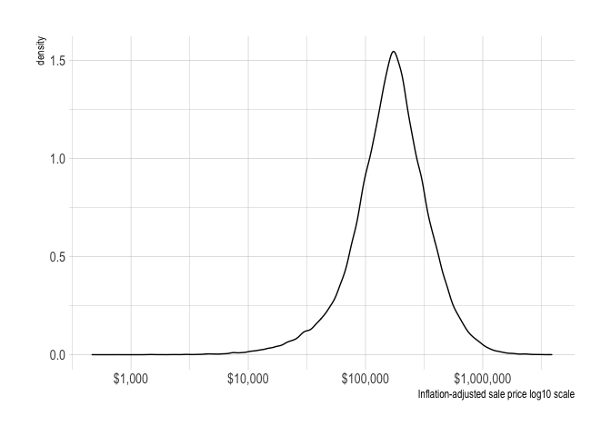<!-- -->

Adjusting for inflation (`sale_price_adj` is in 2022 dollars) removes a
lot of the drift over time.

``` r
assessments_valid %>%
  select(sale_year, sale_price, sale_price_adj) %>% 
  pivot_longer(cols = contains("sale_price")) %>% 
  mutate(name = case_when(name == "sale_price" ~ "Nominal dollars",
                          name == "sale_price_adj" ~ "Inflation-adjusted 2022 dollars")) %>% 
  group_by(sale_year, name) %>% 
  summarize(median_price = median(value)) %>% 
  ggplot(aes(sale_year, median_price, color = name)) +
  geom_line() +
  scale_y_continuous(labels = dollar) +
  labs(x = "Sale Year",
       y = "Median Price",
       color = NULL)
```

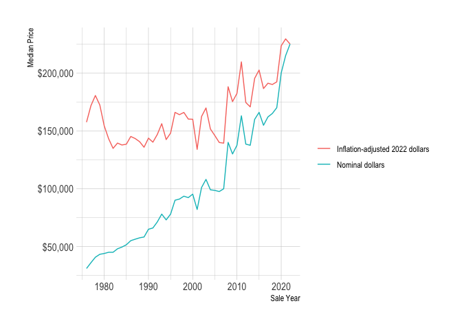<!-- -->

House sales have accelerated since 2010.

``` r
sale_year_count <- assessments_valid %>% 
  count(sale_year)

sale_year_count %>% 
  ggplot(aes(sale_year, n)) +
  geom_smooth(se = F) +
  geom_point() +
  labs(x = "Sale Year",
       y = "Sales",
       color = NULL)
```

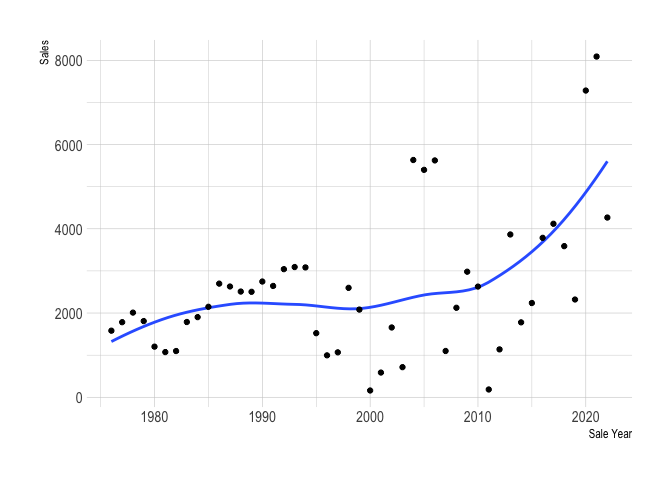<!-- -->

Median sale price and the number of sales both peak over the summer
months.

``` r
assessments_valid %>% 
  mutate(sale_month = fct_rev(sale_month)) %>% 
  add_count(sale_month) %>% 
  ggplot(aes(sale_month, sale_price_adj, group = sale_month, fill = n)) +
  geom_boxplot(outlier.alpha = 0,
               color = "grey") +
  labs(fill = "Sales") +
  scale_y_continuous(labels = label_dollar()) +
  coord_cartesian(ylim = c(0, 500000)) +
  scale_fill_viridis_c() +
  labs(x = NULL,
       y = "Inflation-adjusted sale price")
```

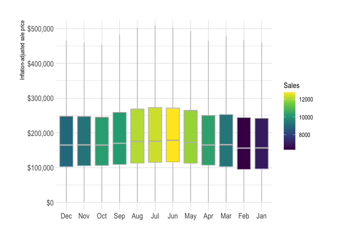<!-- -->

### Location

The location of the house (`geo_id`) has a big impact on
`sale_price_adj`.

``` r
geo_id_median_price <- assessments_valid %>% 
  group_by(geo_id) %>% 
  summarize(median_price = median(sale_price_adj))

geo_id_median_price %>% 
  left_join(geo_ids) %>% 
  st_as_sf() %>% 
  ggplot() +
  geom_sf(aes(fill = median_price)) +
  scale_fill_viridis_c(labels = dollar) +
  labs(fill = "Median price")
```

<!-- -->

``` r
assessments_valid %>%
  add_count(geo_id) %>% 
  mutate(geo_id = fct_reorder(geo_id, sale_price_adj, .fun = median)) %>% 
  ggplot(aes(sale_price_adj, geo_id, fill = n)) +
  geom_boxplot(outlier.alpha = 0,
               color = "grey") +
  scale_x_continuous(label = dollar) +
  scale_fill_viridis_c() +
  coord_cartesian(xlim = c(0, 800000)) +
  labs(fill = "Sales",
       x = "Inflation-adjusted sale price",
       y = NULL)
```

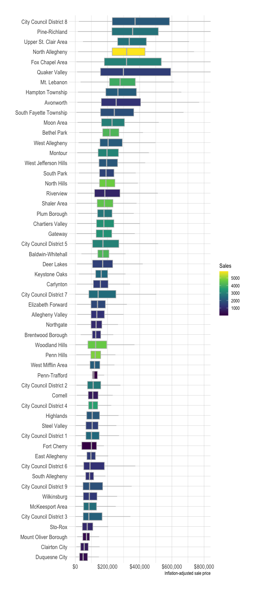<!-- -->

### House Characteristics

The age of the house at time of sale has a negative relationship with
sale price, but is heteroskedastic. This indicates that some houses
retain their value better over time (and/or houses that don’t retain
value aren’t bought and sold).

``` r
assessments_valid %>% 
  ggplot(aes(house_age_at_sale, sale_price_adj)) +
  geom_density_2d_filled(contour_var = "count") +
  scale_y_log10(labels = dollar) +
  guides(fill = guide_colorsteps()) +
  labs(x = "House age at sale",
       y = "Inflation-adjusted sale price log10 scale",
       fill = "Sales")
```

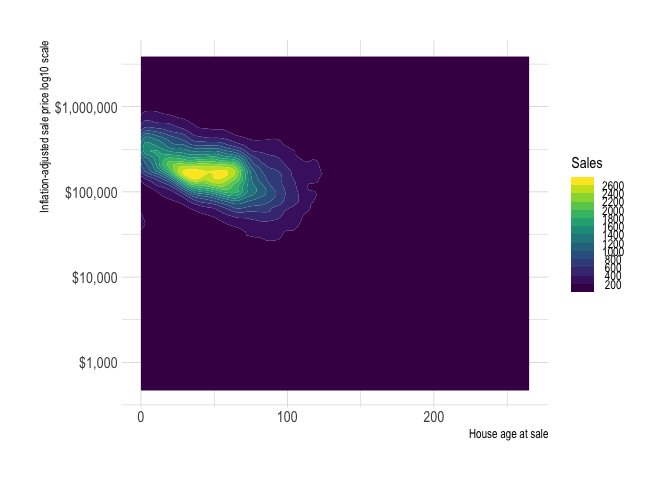<!-- -->

#### Lot Area

There is a positive relationship between `lot_area` and
`sale_price_adj`.

``` r
assessments_valid %>% 
  ggplot(aes(lot_area, sale_price_adj)) +
  geom_density_2d_filled(contour_var = "count") +
  scale_y_log10(labels = dollar) +
  scale_x_log10() +
  guides(fill = guide_colorsteps()) +
  labs(x = "Lot area sq. ft. log10 scale",
       y = "Inflation-adjusted sale price log10 scale",
       fill = "Sales")
```

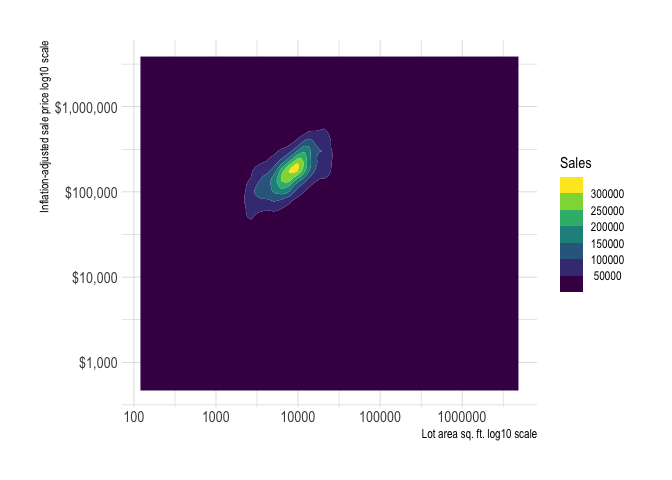<!-- -->

`lot_area` varies drastically across `geo_id`, so there is probably a
useful feature to be engineered.

``` r
assessments_valid %>% 
  add_count(geo_id) %>% 
  mutate(geo_id = fct_reorder(geo_id, lot_area, .fun = median)) %>% 
  ggplot(aes(lot_area, geo_id, fill = n)) +
  geom_boxplot(outlier.alpha = 0,
               color = "grey") +
  scale_fill_viridis_c() +
  coord_cartesian(xlim = c(0, 50000)) +
  labs(x = "Lot Area sq. ft",
       y = "School district",
       fill = "Sales")
```

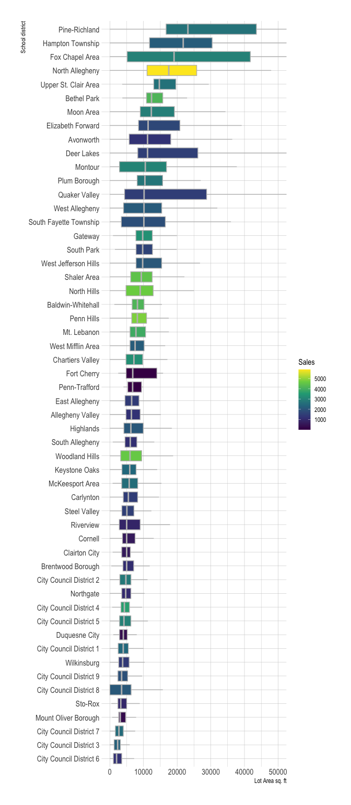<!-- -->

`lot_area` also varies across `style_desc`.

``` r
assessments_valid %>% 
  add_count(style_desc) %>% 
  mutate(style_desc = fct_reorder(style_desc, lot_area, .fun = median)) %>% 
  ggplot(aes(lot_area, style_desc, fill = n)) +
  geom_boxplot(outlier.alpha = 0,
               color = "grey") +
  scale_fill_viridis_c() +
  coord_cartesian(xlim = c(0, 200000)) +
  labs(x = "Lot Area sq. ft.",
       y = "Style",
       fill = "Sales")
```

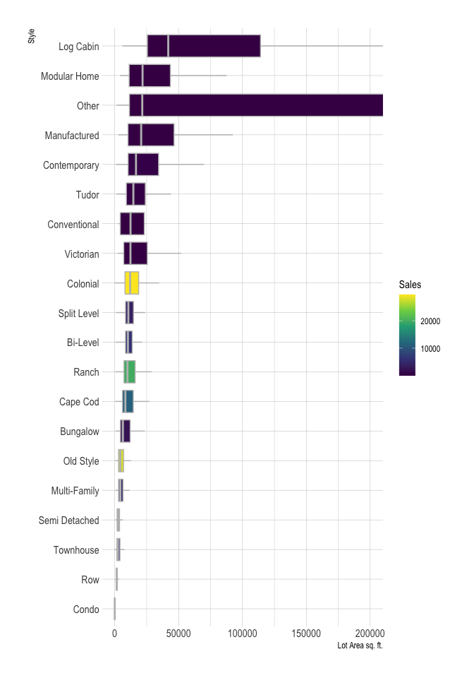<!-- -->

#### Finished Living Area

`finished_living_area` will be a useful variable.

``` r
assessments_valid %>% 
  ggplot(aes(finished_living_area, sale_price_adj)) +
  geom_density_2d_filled(contour_var = "count") +
  scale_x_log10() +
  scale_y_log10(labels = dollar) +
  guides(fill = guide_colorsteps()) +
  labs(x = "Finished Living Area sq. ft. log10 scale",
       y = "Inflation-adjusted sale price log10 scale",
       fill = "Sales")
```

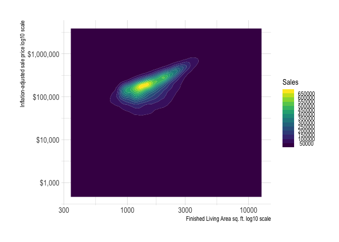<!-- -->

`finished_living_area` also varies across `style_desc`.

``` r
assessments_valid %>% 
  add_count(style_desc) %>% 
  mutate(style_desc = fct_reorder(style_desc, finished_living_area, .fun = median)) %>% 
  ggplot(aes(finished_living_area, style_desc, fill = n)) +
  geom_boxplot(outlier.alpha = 0,
               color = "grey") +
  scale_x_log10() +
  scale_fill_viridis_c() +
  labs(x = "Finished Living Area sq. ft. log10 scale",
       y = "Style",
       fill = "Sales")
```

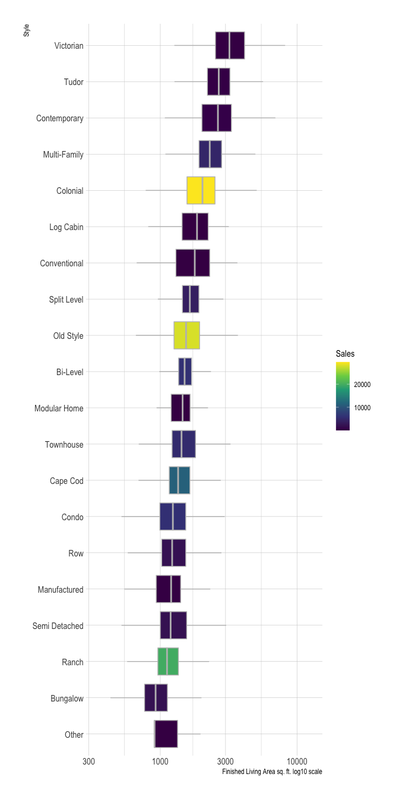<!-- -->

`finished_living_area` also varies across `geo_id`, but not as
drastically.

``` r
assessments_valid %>% 
  add_count(geo_id) %>% 
  mutate(geo_id = fct_reorder(geo_id, finished_living_area, .fun = median)) %>% 
  ggplot(aes(finished_living_area, geo_id, fill = n)) +
  geom_boxplot(outlier.alpha = 0,
               color = "grey") +
  scale_x_log10() +
  scale_fill_viridis_c() +
  labs(x = "Finished Living Area sq. ft. log10 scale",
       y = "School district",
       fill = "Sales")
```

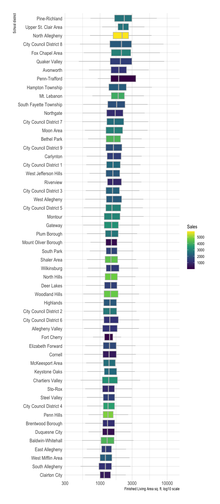<!-- -->

#### Grade

`grade_desc` has a clear relationship with `sale_price_adj`.

``` r
assessments_valid %>% 
  mutate(grade_desc = fct_reorder(grade_desc, sale_price_adj, median)) %>% 
  add_count(grade_desc) %>% 
  ggplot(aes(sale_price_adj, grade_desc, fill = n)) +
  geom_boxplot(outlier.alpha = 0,
               color = "grey") +
  scale_x_log10(labels = dollar) +
  scale_fill_viridis_c() +
  labs(x = "Inflation-adjusted price log10 scale",
       y = "Grade",
       fill = "Sales")
```

<!-- -->

#### Condition

`condition_desc` also has a relationship, but some of the levels can
probably be collapsed.

``` r
assessments_valid %>% 
  mutate(condition_desc = fct_reorder(condition_desc, sale_price_adj, median)) %>% 
  add_count(condition_desc) %>% 
  ggplot(aes(sale_price_adj, condition_desc, fill = n)) +
  geom_boxplot(outlier.alpha = 0,
               color = "grey") +
  scale_x_log10(labels = dollar) +
  scale_fill_viridis_c() +
  labs(x = "Inflation-adjusted price log10 scale",
       y = "Condition",
       fill = "Sales")
```

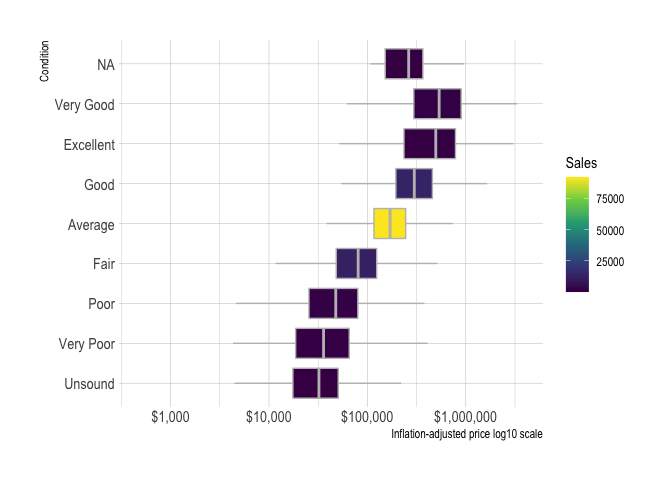<!-- -->

There are 4 main types of houses, with a lot of low-n types that can be
collapsed.

``` r
assessments_valid %>% 
  count(style_desc) %>% 
  mutate(style_desc = fct_reorder(style_desc, n, .fun = max)) %>% 
  ggplot(aes(n, style_desc)) +
  geom_col() +
  labs(x = "Sales",
       y = "Style")
```

<!-- -->

Most houses that have been sold were built between 1940 and 1980.

``` r
assessments_valid %>% 
  count(year_built) %>% 
  ggplot(aes(year_built, n)) +
  geom_point() +
  labs(x = "Year built",
       y = "Count")
```

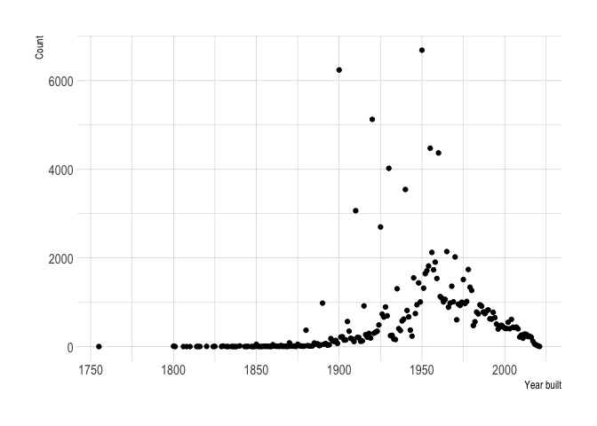<!-- -->

There is some time-series pattern in when different types of houses were
created.

``` r
assessments_valid %>% 
  add_count(style_desc) %>% 
  filter(n > 5000) %>% 
  mutate(style_desc = fct_reorder(style_desc, n, .fun = "max", .desc = T)) %>% 
  ggplot(aes(year_built, fill = style_desc)) +
  geom_histogram(binwdidth = 30) +
  guides(fill = "none") +
  facet_wrap(~style_desc, scales = "free_y", ncol = 2) +
  labs(x = "Year built")
```

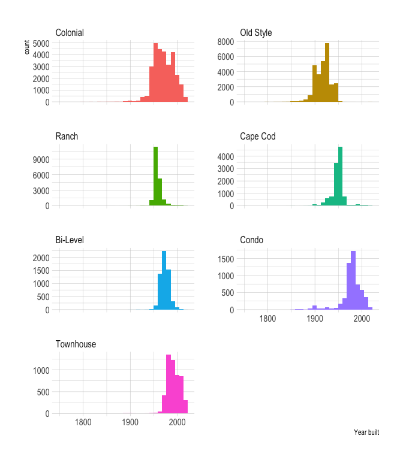<!-- -->

#### Bathrooms

Most homes have between 1 and 2 full and half bathrooms.

``` r
assessments_valid %>% 
  count(full_baths, half_baths) %>% 
  complete(full_baths = 0:12, half_baths = 0:9, fill = list(n = 0)) %>% 
  ggplot(aes(full_baths, half_baths, fill = n)) +
  geom_tile() +
  scale_fill_viridis_c() +
  scale_x_continuous(breaks = c(0:12),
                     expand = c(0,0)) +
  scale_y_continuous(breaks = c(0:12),
                     expand = c(0,0)) +
  coord_equal() +
  labs(x = "Full baths",
       y = "Half baths",
       fill = "Sales") +
  theme(panel.grid.major = element_blank(),
        panel.grid.minor = element_blank())
```

<!-- -->

`fullbaths` and `sale_price_adj` are positively related.

``` r
assessments_valid %>% 
  add_count(full_baths) %>% 
  ggplot(aes(sale_price_adj, full_baths, fill = n, group = full_baths)) +
  geom_boxplot(outlier.alpha = 0,
               color = "grey") +
  scale_x_log10(label = dollar) +
  scale_y_continuous(breaks = c(0:12)) +
  scale_fill_viridis_c() +
  labs(x = "Inflation-adjusted price log10 scale",
       y = "Full baths",
       fill = "Sales")
```

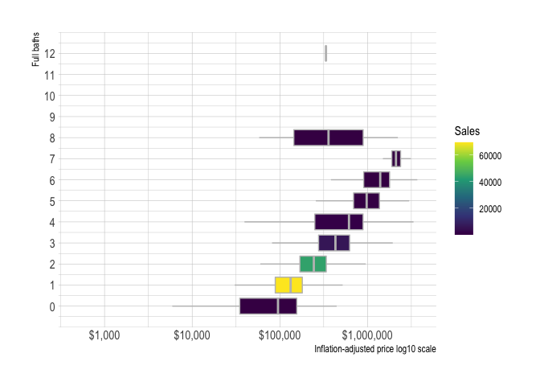<!-- -->

There appear to be diminishing returns on the number of half bathrooms.

``` r
assessments_valid %>% 
  add_count(half_baths) %>% 
  ggplot(aes(sale_price_adj, half_baths, fill = n, group = half_baths)) +
  geom_boxplot(outlier.alpha = 0,
               color = "grey") +
  scale_x_log10(label = dollar) +
  scale_y_continuous(breaks = c(0:9)) +
  scale_fill_viridis_c() +
  labs(x = "Inflation-adjusted price log10 scale",
       y = "Half baths",
       fill = "Sales")
```

<!-- -->

#### Heating and cooling

I will split `heating_cooling_desc` into to `heat_type` and `ac_flag.`

``` r
assessments_valid %>% 
  mutate(heating_cooling_desc = fct_explicit_na(heating_cooling_desc),
         heating_cooling_desc = fct_reorder(heating_cooling_desc, sale_price_adj, .fun = median)) %>% 
  add_count(heating_cooling_desc) %>% 
  ggplot(aes(sale_price_adj, heating_cooling_desc, fill = n)) +
  geom_boxplot(outlier.alpha = 0,
               color = "grey") +
  scale_x_log10(label = dollar) +
  scale_fill_viridis_c() +
  labs(x = "Inflation-adjusted price log10 scale",
       fill = "Sales")
```

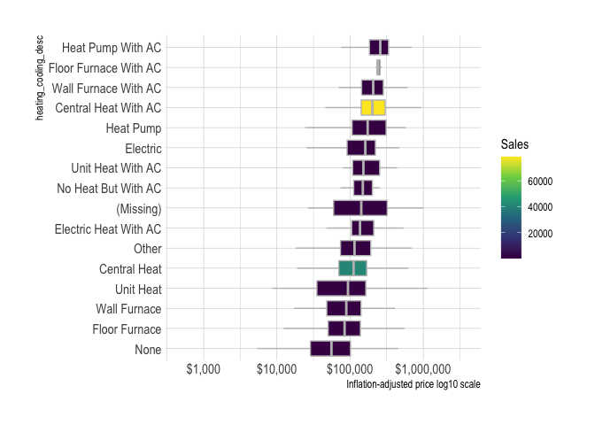<!-- -->

The type of heating is positively related to sale price.

``` r
assessments_valid %>% 
  mutate(heat_type = fct_explicit_na(heat_type),
         heat_type = fct_reorder(heat_type, sale_price_adj, .fun = median)) %>% 
  add_count(heat_type) %>% 
  ggplot(aes(sale_price_adj, heat_type, fill = n)) +
  geom_boxplot(outlier.alpha = 0,
               color = "grey") +
  scale_x_log10(label = dollar) +
  scale_fill_viridis_c() +
  labs(x = "Inflation-adjusted price log10 scale",
       y = "Heat type",
       fill = "Sales")
```

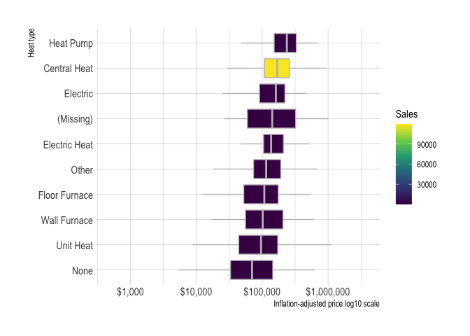<!-- -->

Whether the house has AC is also positively related to sale price.

``` r
assessments_valid %>% 
  mutate(ac_flag = as.character(ac_flag),
         ac_flag = fct_explicit_na(ac_flag)) %>% 
  mutate(ac_flag = fct_reorder(ac_flag, sale_price_adj, .fun = median)) %>% 
  add_count(ac_flag) %>% 
  ggplot(aes(sale_price_adj, ac_flag, fill = n)) +
  geom_boxplot(outlier.alpha = 0,
               color = "grey") +
  scale_x_log10(label = dollar) +
  scale_fill_viridis_c() +
  labs(x = "Inflation-adjusted price log10 scale",
       y = "AC",
       fill = "Sales")
```

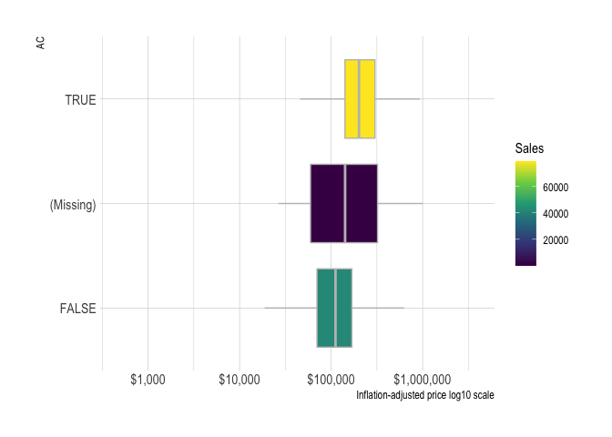<!-- -->

#### Exterior

Impute missing based on mode for `geo_id` and `style_desc.`

``` r
assessments_valid %>% 
  mutate(extfinish_desc = fct_explicit_na(extfinish_desc),
         extfinish_desc = fct_reorder(extfinish_desc, sale_price_adj, .fun = median)) %>% 
  add_count(extfinish_desc) %>% 
  ggplot(aes(sale_price_adj, extfinish_desc, fill = n)) +
  geom_boxplot(outlier.alpha = 0,
               color = "grey") +
  scale_x_log10(label = dollar) +
  scale_fill_viridis_c() +
  labs(x = "Inflation-adjusted price log10 scale",
       fill = "Sales")
```

<!-- -->

#### Roof

Impute missing based on mode for `geo_id` and `style_desc.`

``` r
assessments_valid %>% 
  mutate(roof_desc = fct_explicit_na(roof_desc),
         roof_desc = fct_reorder(roof_desc, sale_price_adj, .fun = median)) %>% 
  add_count(roof_desc) %>% 
  ggplot(aes(sale_price_adj, roof_desc, fill = n)) +
  geom_boxplot(outlier.alpha = 0,
               color = "grey") +
  scale_x_log10(label = dollar) +
  scale_fill_viridis_c() +
  labs(x = "Inflation-adjusted price log10 scale",
       fill = "Sales")
```

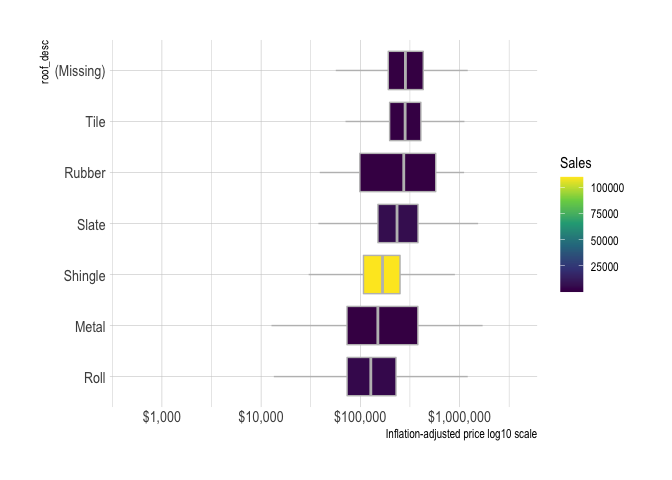<!-- -->

#### Basement

Impute missing based on mode for `geo_id` and `style_desc.`

``` r
assessments_valid %>% 
  mutate(basement_desc = fct_explicit_na(basement_desc),
         basement_desc = fct_reorder(basement_desc, sale_price_adj, .fun = median)) %>% 
  add_count(basement_desc) %>% 
  ggplot(aes(sale_price_adj, basement_desc, fill = n)) +
  geom_boxplot(outlier.alpha = 0,
               color = "grey") +
  scale_x_log10(label = dollar) +
  scale_fill_viridis_c() +
  labs(x = "Inflation-adjusted price log10 scale",
       fill = "Sales")
```

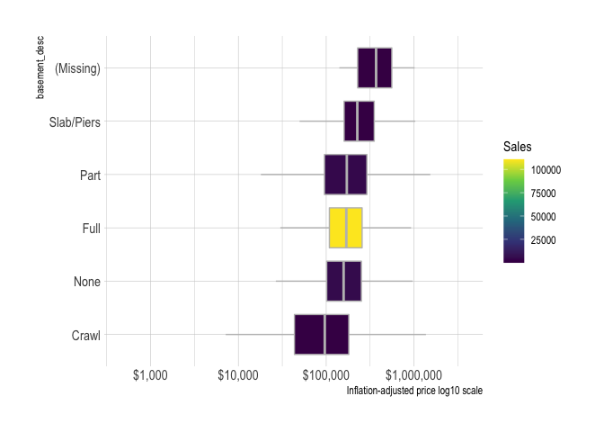<!-- -->

#### Basement garage

Impute missing based on mode for `geo_id` and `style_desc.` Need to look
up what this column is. Number of cars that can fit in the basement
garage?

``` r
max_basement_garage <- assessments_valid %>% 
  summarize(max(basement_garage, na.rm = T)) %>% 
  pull()

assessments_valid %>% 
  select(sale_price_adj, basement_garage) %>% 
  mutate(basement_garage = as.character(basement_garage),
         basement_garage = fct_explicit_na(basement_garage),
         basement_garage = fct_relevel(basement_garage, c(as.character(0:max_basement_garage), "(Missing)"))) %>% 
  add_count(basement_garage) %>% 
  ggplot(aes(sale_price_adj, basement_garage, group = basement_garage, fill = n)) +
  geom_boxplot(outlier.alpha = 0,
               color = "grey") +
  scale_x_log10(label = dollar) +
  scale_fill_viridis_c() +
  labs(x = "Inflation-adjusted price log10 scale",
       fill = "Sales")
```

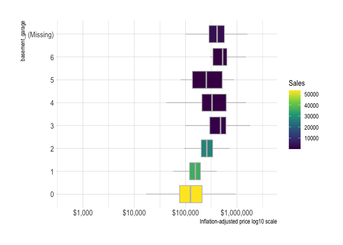<!-- -->

#### Fireplaces

Positive relationship between number of fireplaces and sale price, but
most houses have 1 or 2. Consider changing to lgl `fireplace_flag`
column where it checks `fireplaces` \>= 1.

``` r
max_fireplaces <- assessments_valid %>% 
  summarize(max(fireplaces, na.rm = T)) %>% 
  pull()

assessments_valid %>% 
  select(sale_price_adj, fireplaces) %>% 
  mutate(fireplaces = as.character(fireplaces),
         fireplaces = fct_explicit_na(fireplaces),
         fireplaces = fct_relevel(fireplaces, c(as.character(0:max_fireplaces), "(Missing)"))) %>% 
  add_count(fireplaces) %>% 
  ggplot(aes(sale_price_adj, fireplaces, group = fireplaces, fill = n)) +
  geom_boxplot(outlier.alpha = 0,
               color = "grey") +
  scale_x_log10(label = dollar) +
  scale_fill_viridis_c() +
  labs(x = "Inflation-adjusted price log10 scale",
       fill = "Sales")
```

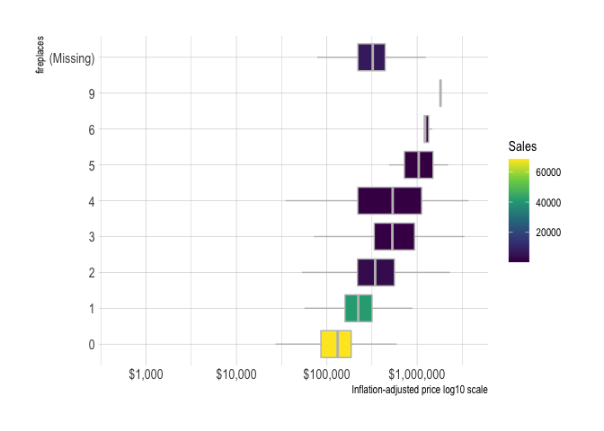<!-- -->

### Identify UI cutoffs

``` r
assessments_valid %>% 
  ggplot(aes(lot_area)) +
  geom_density() +
  geom_vline(xintercept = 40000) +
  scale_x_log10()
```

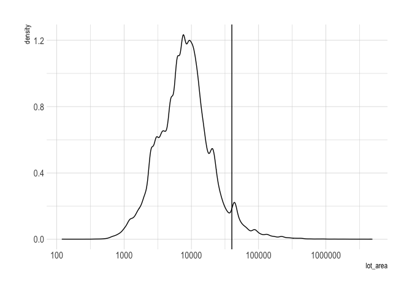<!-- -->

``` r
assessments_valid %>% 
  ggplot(aes(finished_living_area)) +
  geom_density() +
  scale_x_log10() +
  geom_vline(xintercept = 10000)
```

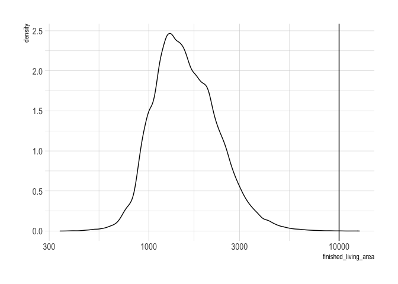<!-- -->
