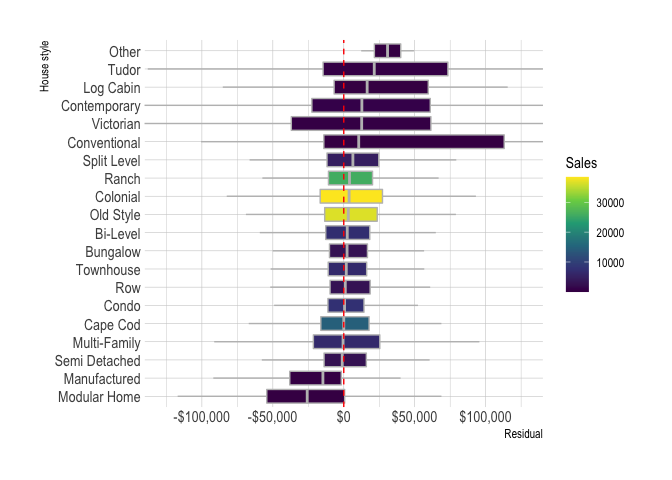

Review Model Results
================
Conor Tompkins
2021-07-24

``` r
library(tidyverse)
library(janitor)
library(hrbrthemes)

library(tidymodels)
library(recipes)
library(baguette)

library(sf)
library(leaflet)

library(here)

theme_set(theme_ipsum())

options(scipen = 999, digits = 4)

model_fit_path <- here("data/modelling/objects", "bag_model_fit_V.03.rds")

model_results_path <- here("data/modelling/results", "bag_full_model_results.csv")

unified_geo_ids_path <- here("data/cleaned/big/unified_geo_ids", "unified_geo_ids.shp")

model_metrics_train_path <- here("data/modelling/metrics", "train_metrics.csv")

model_metrics_test_path <- here("data/modelling/metrics", "test_metrics.csv")

model_fit <- read_rds(model_fit_path)

model_results <- read_csv(model_results_path) %>% 
  mutate(sale_price_adj = 10^sale_price_adj,
         .pred_dollar = 10^.pred,
         .resid = sale_price_adj - .pred_dollar)

geo_ids <- st_read(unified_geo_ids_path, quiet = T)

metrics_train <- read_csv(model_metrics_train_path)

metrics_test <- read_csv(model_metrics_test_path)
```

review model assessment data for train and test data

``` r
glimpse(model_results)
```

    ## Rows: 157,925
    ## Columns: 22
    ## $ .pred                <dbl> 4.852, 5.121, 5.932, 4.995, 4.759, 5.222, 5.387, …
    ## $ par_id               <chr> "0467B00005000000", "0481L00052000000", "0936P003…
    ## $ sale_price_adj       <dbl> 78314, 110456, 816887, 104789, 61624, 220912, 204…
    ## $ house_age_at_sale    <dbl> 61, 32, 52, 83, 79, 61, 13, 0, 29, 56, 70, 8, 37,…
    ## $ sale_year            <dbl> 2006, 2011, 2010, 1998, 2006, 2011, 1987, 1985, 2…
    ## $ sale_month           <chr> "Jun", "Apr", "Dec", "Aug", "Mar", "Jun", "Jul", …
    ## $ lot_area             <dbl> 4680, 1373, 68346, 29673, 6806, 11979, 11784, 600…
    ## $ finished_living_area <dbl> 1026, 1388, 4958, 1388, 840, 1167, 2132, 1760, 91…
    ## $ bedrooms             <dbl> 3, 2, 4, 2, 2, 3, 4, 3, 2, 3, 4, 3, 3, 5, 4, 4, 2…
    ## $ full_baths           <dbl> 1, 1, 4, 2, 1, 1, 2, 2, 1, 1, 1, 2, 1, 3, 2, 2, 1…
    ## $ half_baths           <dbl> 0, 1, 2, 0, 0, 0, 1, 1, 0, 0, 1, 1, 1, 1, 1, 1, 0…
    ## $ geo_id               <chr> "South Allegheny", "South Fayette Township", "Qua…
    ## $ style_desc           <chr> "Old Style", "Townhouse", "Contemporary", "Bungal…
    ## $ grade_desc           <chr> "Average", "Average", "Very Good", "Average", "Be…
    ## $ condition_desc       <chr> "Average", "Average", "Average", "Average", "Aver…
    ## $ ac_flag              <lgl> TRUE, TRUE, TRUE, FALSE, TRUE, TRUE, TRUE, TRUE, …
    ## $ heat_type            <chr> "Central Heat", "Central Heat", "Central Heat", "…
    ## $ longitude            <dbl> -79.89, -80.12, -80.18, -79.86, -79.90, -79.88, -…
    ## $ latitude             <dbl> 40.33, 40.33, 40.58, 40.27, 40.38, 40.49, 40.54, …
    ## $ year_built           <dbl> 1945, 1979, 1958, 1915, 1927, 1950, 1974, 1985, 1…
    ## $ .pred_dollar         <dbl> 71146, 132153, 854738, 98803, 57443, 166745, 2435…
    ## $ .resid               <dbl> 7168, -21697, -37850, 5986, 4181, 54167, -38575, …

``` r
metrics_test
```

    ## # A tibble: 3 x 3
    ##   .metric .estimator   .estimate
    ##   <chr>   <chr>            <dbl>
    ## 1 rmse    standard    216212.   
    ## 2 rsq     standard         0.628
    ## 3 mape    standard   3229245.

``` r
model_results %>% 
  ggplot(aes(.resid)) +
  geom_density() +
  geom_vline(xintercept = 0, lty = 2) +
  scale_x_continuous(label = label_dollar())
```

<!-- -->

``` r
model_results %>% 
  ggplot(aes(sale_price_adj, .pred_dollar)) +
  geom_density_2d_filled(contour_var = "count") +
  scale_x_log10(label = label_dollar()) +
  scale_y_log10(label = label_dollar()) +
  guides(fill = guide_coloursteps()) +
  labs(x = "Inflation-adjusted sale price log10 scale",
       y = "Prediction",
       fill = "Sales")
```

<!-- -->

The model becomes less effective as the actual sale price increases.

``` r
model_results %>% 
  ggplot(aes(sale_price_adj, .resid)) +
  geom_point(alpha = .01) +
  scale_x_log10(label = dollar) +
  scale_y_continuous(label = dollar) +
  labs(x = "Inflation-adjusted sale price log10 scale",
       y = "Residual")
```

<!-- -->

The model has larger errors in the very wealthy neighborhoods.

``` r
geo_id_rmse <- model_results %>% 
  group_by(geo_id) %>% 
  rmse(truth = sale_price_adj, estimate = .pred_dollar)

geo_id_rmse %>% 
  left_join(geo_ids) %>% 
  st_as_sf() %>% 
  ggplot() +
  geom_sf(aes(fill = .estimate)) +
  scale_fill_viridis_c(labels = dollar) +
  labs(fill = "RMSE")
```

<!-- -->

``` r
model_results %>% 
  add_count(geo_id) %>% 
  mutate(geo_id = fct_reorder(geo_id, .resid, .fun = median)) %>% 
  ggplot(aes(.resid, geo_id, fill = n)) +
  geom_boxplot(color = "grey",
               outlier.alpha = 0) +
  geom_vline(xintercept = 0, lty = 2, color = "red") +
  scale_x_continuous(labels = dollar) +
  scale_fill_viridis_c() +
  coord_cartesian(xlim = c(-10^5, 10^5)) +
  labs(x = "Residual",
       fill = "Sales")
```

<!-- -->

``` r
model_results %>% 
  add_count(style_desc) %>% 
  mutate(style_desc = fct_reorder(style_desc, .resid, .fun = median)) %>% 
  ggplot(aes(.resid, style_desc, fill = n)) +
  geom_boxplot(color = "grey",
               outlier.alpha = 0) +
  geom_vline(xintercept = 0, lty = 2, color = "red") +
  coord_cartesian(xlim = c(-10.5^5, 10.5^5)) +
  scale_x_continuous(labels = label_dollar()) +
  scale_fill_viridis_c() +
  labs(fill = "Sales",
       x = "Residual",
       y = "House style")
```

<!-- -->

``` r
model_results %>% 
  add_count(grade_desc) %>% 
  mutate(grade_desc = fct_reorder(grade_desc, .resid, .fun = median)) %>% 
  ggplot(aes(.resid, grade_desc, fill = n)) +
  geom_boxplot(color = "grey",
               outlier.alpha = 0) +
  scale_fill_viridis_c() +
  scale_x_continuous(labels = label_dollar()) +
  coord_cartesian(xlim = c(-10^5, 10.5^6)) +
  labs(x = "Residual",
       y = "Grade",
       fill = "Sales")
```

<!-- -->

``` r
model_results %>% 
  add_count(condition_desc) %>% 
  mutate(condition_desc = fct_explicit_na(condition_desc),
         condition_desc = fct_reorder(condition_desc, .resid, .fun = median)) %>% 
  ggplot(aes(.resid, condition_desc, fill = n)) +
  geom_boxplot(color = "grey",
               outlier.alpha = 0) +
  geom_vline(xintercept = 0, lty = 2, color = "red") +
  scale_fill_viridis_c() +
  scale_x_continuous(labels = label_dollar()) +
  coord_cartesian(xlim = c(-10^5, 10.5^5)) +
  labs(x = "Residual",
       y = "Condition",
       fill = "Sales")
```

<!-- -->

``` r
model_results %>% 
  ggplot(aes(finished_living_area, .resid)) +
  geom_point(alpha = .1) +
  scale_x_log10() +
  scale_y_continuous(label = dollar) +
  labs(x = "Finished Living Area sq. ft. log10 scale",
       y = "Residual")
```

<!-- -->

``` r
model_results %>% 
  ggplot(aes(lot_area, .resid)) +
  geom_point(alpha = .1) +
  scale_x_log10(labels = label_comma()) +
  scale_y_continuous(labels = label_dollar()) +
  labs(x = "Lot Area sq. ft. log10 scale",
       y = "Residual")
```

<!-- -->

``` r
model_results %>% 
  group_by(house_age_at_sale) %>% 
  rmse(truth = sale_price_adj, estimate = .pred_dollar) %>% 
  ggplot(aes(house_age_at_sale, .estimate)) +
  geom_point(alpha = .5) +
  scale_y_continuous(labels = label_dollar()) +
  labs(x = "House age at sale",
       y = "RMSE")
```

<!-- -->

The model is best at predicting the sale price of houses built in the
1940s to 1980s. This is when most of the houses in the county were
built.

``` r
model_results %>% 
  group_by(year_built) %>% 
  rmse(truth = sale_price_adj, estimate = .pred_dollar) %>% 
  ggplot(aes(year_built, .estimate)) +
  geom_point(alpha = .5) +
  scale_y_continuous(labels = label_dollar()) +
  labs(x = "Year Built",
       y = "RMSE")
```

<!-- -->

``` r
model_results %>% 
  add_count(bedrooms) %>% 
  ggplot(aes(.resid, bedrooms, group = bedrooms, fill = n)) +
  geom_boxplot(color = "grey",
               outlier.alpha = 0) +
  geom_vline(xintercept = 0, lty = 2, color = "red") +
  scale_y_continuous(breaks = c(0:15)) +
  scale_fill_viridis_c() +
  scale_x_continuous(labels = label_dollar()) +
  coord_cartesian(xlim = c(-10^5, 10^5)) +
  labs(x = "Residual",
       y = "Bedrooms",
       fill = "Sales")
```

<!-- -->

``` r
model_results %>% 
  add_count(full_baths) %>% 
  ggplot(aes(.resid, full_baths, group = full_baths, fill = n)) +
  geom_boxplot(color = "grey",
               outlier.alpha = 0) +
  geom_vline(xintercept = 0, lty = 2, color = "red") +
  scale_y_continuous(breaks = c(0:12)) +
  scale_fill_viridis_c() +
  scale_x_continuous(label = dollar) +
  coord_cartesian(xlim = c(-10^5, 750000)) +
  labs(x = "Residual",
       y = "Full bathrooms",
       fill = "Sales")
```

<!-- -->

``` r
model_results %>% 
  add_count(half_baths) %>% 
  ggplot(aes(.resid, half_baths, group = half_baths, fill = n)) +
  geom_boxplot(color = "grey",
               outlier.alpha = 0) +
  geom_vline(xintercept = 0, lty = 2, color = "red") +
  scale_y_continuous(breaks = c(0:8)) +
  scale_x_continuous(labels = label_dollar()) +
  scale_fill_viridis_c() +
  coord_cartesian(xlim = c(-10^5, 10^5)) +
  labs(x = "Residual",
       y = "Half bathrooms",
       fill = "Sales")
```

<!-- -->

``` r
model_results %>% 
  group_by(sale_year) %>% 
  rmse(truth = sale_price_adj, estimate = .pred_dollar) %>% 
  ggplot(aes(sale_year, .estimate)) +
  geom_line() +
  scale_y_continuous(label = dollar) +
  labs(x = "Sale year",
       y = "RMSE")
```

<!-- -->
